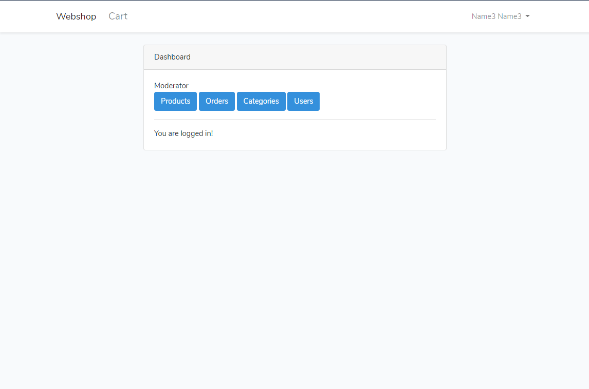

# Webshop

### Login

### Register

## Customer

### Home page

### Cart

### Checkout

### Checkout add/remove product

### Checkout result

### Customer dashboard

### Customer profile

### Orders

### Order part

## Moderator

### Moderator dashboard

### Product list

### Create product

### Orders

### Customer data

### Order part

### Categories

### Customer list

## Admin

### Admin dashboard

### Users

### Edit user

### Create user

